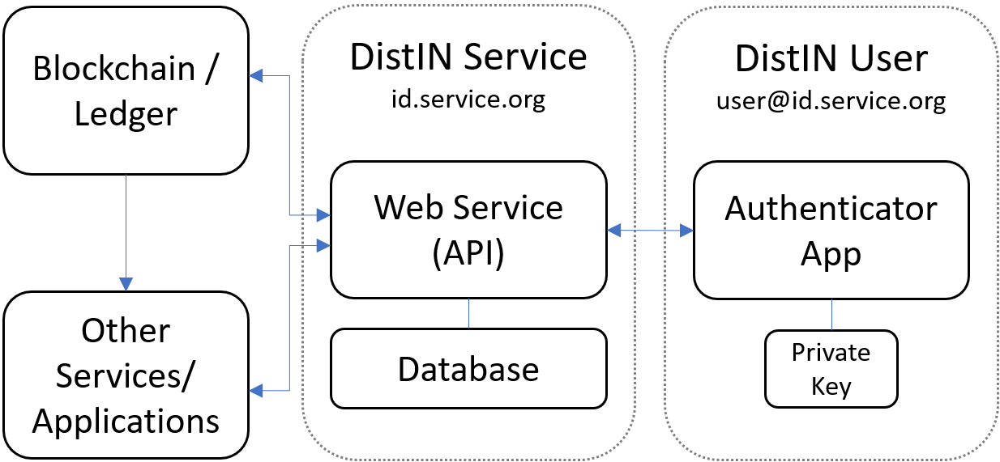
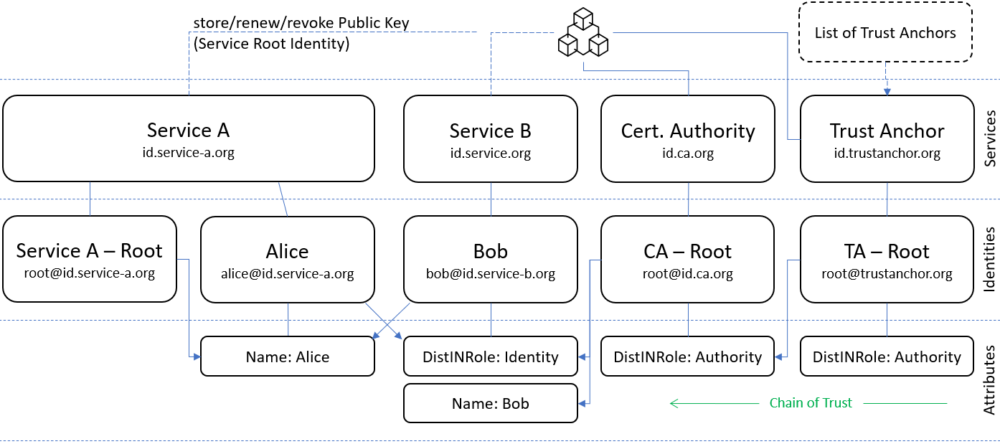

# DistIN - Distributed Identity Information Network

The concept for a Distributed Identity Information Network (DistIN) is based on a web-based protocol that can be implemented in existing web applications, but will also be provided as a standalone reference implementation including installation instructions at a later point in time, so that a fully functional application can be set up and used.

For implementation view the protocol documentation that explanes the required HTTP(S) actions that have to be implemented into a web application that is intended to support the DistIN protocol.

[-> Protocol Documentation](Protocol/README.md)

## General Architecture

The DistIN services play the mayor role inside this identity network. It provides the web application and endpoint for its identitiesand holds a database with the identities' information. The identities only have their authenticator application that contains the private key. This architecture requires a strong trust relationship between service and identity and is primarily ment for organizational context, but also allows a higher decentralization as federated identity systems.

## Identity Management and Web/Chain of Trust

The figure below shows an example where Alice and Bob beling to different services, but can build a web of trust, while, as far as CAs are involved in the network, chains of trust can be built for uses cases like identity validation.

### Acknowledgment
This work originates from the LIONS research project. LIONS is funded by dtec.bw –- Digitalization and Technology Research Center of the Bundeswehr, which we gratefully acknowledge. dtec.bw is funded by the European Union –- NextGenerationEU.
