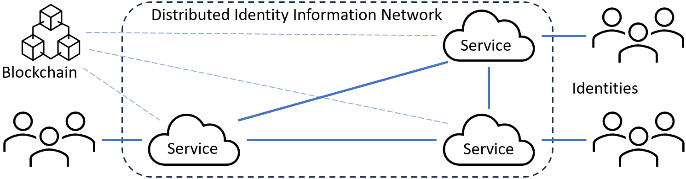

# DistIN - Distributed Identity Information Network

For implementation view the protocol documentation that explanes the required HTTP(S) actions that have to be implemented into a web application that is intended to support the DistIN protocol.

[-> Protocol Documentation](Protocol/README.md)

### Acknowledgment
This work originates from the LIONS research project. LIONS is funded by dtec.bw –- Digitalization and Technology Research Center of the Bundeswehr, which we gratefully acknowledge. dtec.bw is funded by the European Union –- NextGenerationEU.
